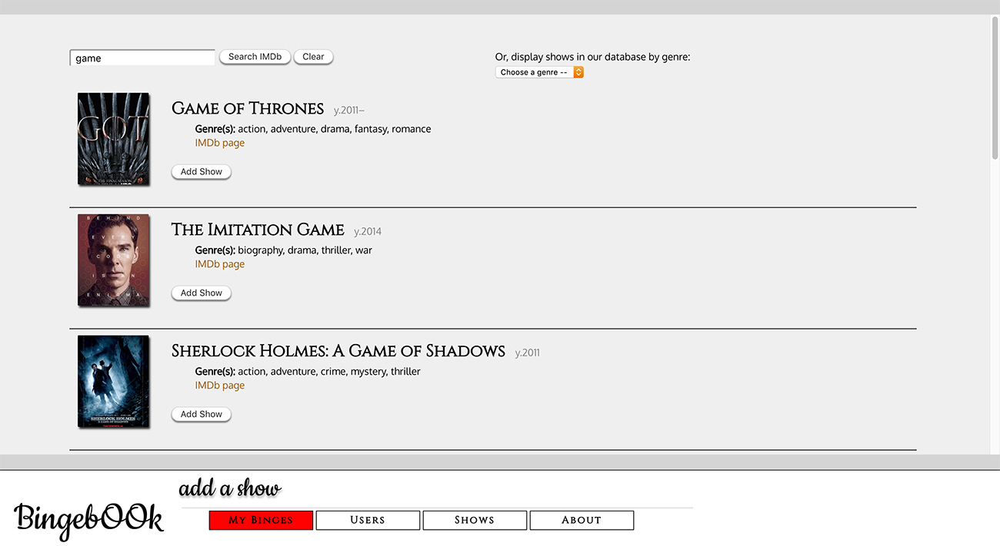

# Bingebook (back end) (full-stack app)

### **Developer: JOSEPH P. PASAOA**

### _Table of Contents_
+ [Technologies Implemented](#technologies-implemented)
+ [Setup](#setup)
+ [Resources Used](#resources-used)
+ [Developer's To Dos](#i-to-do)
+ [Database Schema](#ii-working-database-schema)
+ [Endpoints](#iii-functional-endpoints)



## Instructional Team
+ **LEAD Instructor:** [Alejandro Franco -- ( @alejo4373 )](https://github.com/alejo4373)
+ **IA:** [Jung Rae Jang -- ( @jungraejang )](https://github.com/jungraejang)
+ **IA:** [Wynter Reid -- ( @wynterreid )](https://github.com/wynterreid)
+ **Program Manager:** [Dessa Shepherd](https://www.linkedin.com/in/dessa-shepherd-7a55b374/)

## Technologies Implemented
+ PostgreSQL 12.1
+ Express.js 4.16.1
+ React 16.12.0
+ React/Redux 7.1.3
+ Redux 4.0.5
+ React Router Web 5.1.2
+ Pg-promise 10.3.2
+ Axios 0.19.2
+ Node.js 13.8.0
+ JavaScript 2019 / ECMAScript 10
+ HTML5
+ CSS3
+ Git / Github

## Setup
+ To run this project, instantiate and seed the database with PostgreSQL:
  ```
  $ cd server/db
  $ psql -f bingebook_db.sql
  ```
+ Obtain api key from [Omdb API](http://www.omdbapi.com/apikey.aspx) and paste it into the keyholder file, then install the server locally using npm:
  ```
  $ // using your editor of choice, paste api key into pasteApiKeyHere.js and save
  $ cd server
  $ npm install
  $ npm start
  ```
+ In another terminal instance install the frontend locally using npm:
  ```
  $ cd client
  $ npm install
  $ npm start
  ```
+ The site app will be found at: http://localhost:11222/

## Resources Used
  - [OMDb API: The Open Movie Database](http://www.omdbapi.com/)
  - [Flaticon Icons](https://www.flaticon.com/)
    - [Sporting Avatars](https://www.flaticon.com/packs/sporting-avatars) by [Freepik](https://www.flaticon.com/authors/freepik)

---

## Developer's Notes

### **I. TO DO**
  - ~~database file~~
  - ~~back-end (main pass)~~
  - ~~front-end (main pass)~~
  - ~~reach mvp~~
  - *post-mvp:*
    - animated placeholder for still-loading-page status
    - edit and delete watch statuses
    - edit and delete comments
    - avatar upload sys
    - user auth sys
    - refactor navbar
    - refactor route handling
    - better front-end error handling

  ---

### **II. Working database SCHEMA**
  - **Users**
    - id
    - username - _Unique, Not Null_
    - avatar_url 

  - **Shows**
    - id
    - imdb_id
    - title - _Not Null_
    - year
    - img_url
    - ---
    - *~~genre_id - _References Genres_~~* _(moved to new Shows-Genres)_
    - ~~user_id - _References Users_~~ _(moved to new Users-Shows)_

  - **Genres**
    - id
    - name - _Unique, Not Null_

  - **Users_Shows**
    - id
    - user_id - _References Users + On Delete Cascade_
    - show_id - _References Shows + On Delete Cascade_
    - watch_status - ("onRadar", "now", "watched")
    - is_top3 - (bool)

  - **Shows_Genres**
    - id
    - show_id - _References Shows + On Delete Cascade_
    - genre_id - _References Genres + On Delete Cascade_

  - **Comments**
    - id
    - commenter_id - _References Users + On Delete Cascade_
    - usershow_id - _References Users-Shows + On Delete Cascade_
    - time_modified
    - body - _Not Null_
    - ---
    - ~~user_id - _References Users_~~ _(redundant by new usershow_id)_
    - ~~show_id - _References Shows_~~ _(redundant by new usershow_id)_

  ---

### **III. Functional ENDPOINTS**
  - **Users**

    | Method | Endpoint     | Description           | Body Data                |
    | ------ | ------------ | --------------------- | ------------------------ |
    | GET    | `/users`     | Get all users         | n/a                      |
    | GET    | `/users/:id` | Get single user by id | n/a                      |
    | POST   | `/users/`    | Add new user          | `username`, `avatarUrl`  |

  - **Shows**

    | Method | Endpoint                 | Description                         | Body Data                                 |
    | ------ | ------------------------ | ----------------------------------- | ----------------------------------------- |
    | GET    | `/shows`                 | Get all shows                       | n/a                                       |
    | GET    | `/shows/:id`             | Get single show by id               | n/a                                       |
    | GET    | `/shows/genre/:genre_id` | Get all shows of genre              | n/a                                       |
    | GET    | `/shows/imdb/:imdb_id`   | Get single show by Imdb id          | n/a                                       |
    | POST   | `/shows`                 | Add new show                        | `imdb_id`, `title`, `year`, `img_url`     |

  - **Genres**

    | Method | Endpoint  | Description    | Body Data    |
    | ------ | --------- | -------------- | ------------ |
    | GET    | `/genres` | Get all genres | n/a          |
    | POST   | `/genres` | Add new genre  | `name`       |

  - **Users-Shows**

    | Method | Endpoint                     | Description                                  | Body Data                                       |
    | ------ | ---------------------------- | -------------------------------------------- | ----------------------------------------------- |
    | GET    | `/users-shows/` | Get all user-show relationships in hashmap           | n/a                                             |
    | GET    | `/users-shows/user/:user_id` | Get all shows for specific user_id           | n/a                                             |
    | GET    | `/users-shows/show/:show_id/user/:user_id` | Get the complete dataset of a specific user-show relationship | n/a                                             |
    | GET    | `/user/:user_id/imdb/:imdb_id` | Get bool res if whether user-show(by imdbId) relation exists in db | n/a                                             |
    | POST   | `/create/:user_id/:imdb_id`  | Add new user-show connection w/ watch status | `watch_status`; if new show, also: `title`, `year`, `imgUrl` |
    | PATCH  | `/update/:user_id/:show_id`  | Update user-show connection                  | `watch_status` (optional), `is_top3` (optional) |

  - **Shows-Genres**

    | Method | Endpoint                                     | Description                          | Body Data     |
    | ------ | -------------------------------------------- | ------------------------------------ | ------------- |
    | GET    | `/shows-genres/genre/:name`                  | Get all shows by specific genre name | n/a           |
    | POST   | `/shows-genres/create/:show_id/:genre_name`  | Add new show-genre relationship      | n/a           |

  - **Comments**

    | Method | Endpoint                             | Description                                      | Body Data                      |
    | ------ | ------------------------------------ | ------------------------------------------------ | ------------------------------ |
    | GET    | `/comments/:watcher_id/:show_id`     | Get all comments for specific user-show page     | n/a                            |
    | POST   | `/comments/add/:user_show_id`        | Add new comment                                  | `commenterId`, `comment`       |

---

---