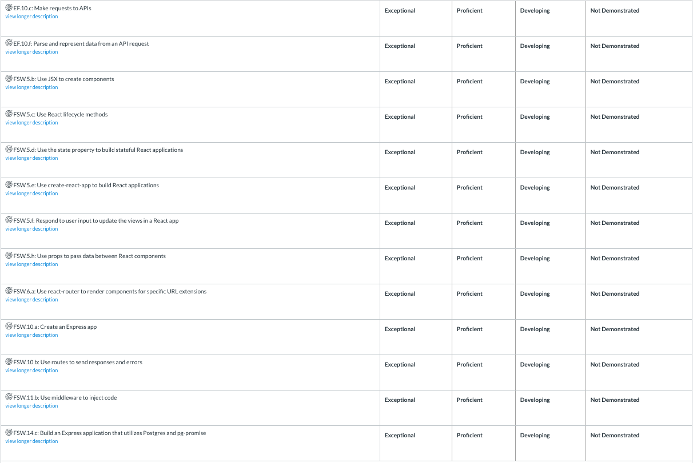

# Bingebook (back end) (full-stack app)

## Repos
+ [Back End](https://github.com/joseph-p-pasaoa/bingebook_backE__FullStack)
+ [Front End](https://github.com/joseph-p-pasaoa/bingebook_frontE__FullStack) (this repo)

## Developer
+ **JOSEPH P. PASAOA**

## Instructional Team
+ **LEAD Instructor:** [Alejandro Franco -- ( @alejo4373 )](https://github.com/alejo4373)
+ **IA:** [Jung Rae Jang -- ( @jungraejang )](https//github.com/jungraejang)
+ **IA:** [Wynter Reid -- ( @wynterreid )](https://github.com/wynterreid)


## Developer's Notes

+ **I. TO DO**
  - ~~database file~~
  - back-end
    - addUserShow handler -> show not in db check forward to auto(?) add show
  - front-end
  - *back-burners:*
    - admin console ?
      - admin DELETE
      - display existing users
      - display existing genres
      - display existing shows
    - avatar upload sys
    - user auth


+ **II. Working database SCHEMA**
  - **Users**
    - id
    - username - _Unique, Not Null_
    - avatar_url 

  - **Shows**
    - id
    - imdb_id
    - title - _Not Null_
    - year
    - img_url
    - ~~genre_id - _References Genres_~~ _(moved to new Shows-Genres)_
    - ~~user_id - _References Users_~~ _(moved to new Users-Shows)_

  - **Genres**
    - id
    - name - _Unique, Not Null_

  - **Users_Shows**
    - id
    - user_id - _References Users + On Delete Cascade_
    - show_id - _References Shows + On Delete Cascade_
    - watch_status - ("onRadar", "now", "watched")
    - is_top3 - (bool)

  - **Shows_Genres**
    - id
    - show_id - _References Shows + On Delete Cascade_
    - genre_id - _References Genres + On Delete Cascade_

  - **Comments**
    - id
    - commenter_id - _References Users + On Delete Cascade_
    - usershow_id - _References Users-Shows + On Delete Cascade_
    - time_modified
    - body - _Not Null_
    - ~~user_id - _References Users_~~ _(redundant by new usershow_id)_
    - ~~show_id - _References Shows_~~ _(redundant by new usershow_id)_


+ **III. Functional ENDPOINTS**
  - **Users**

    | Method | Endpoint     | Description           | Body Data                |
    | ------ | ------------ | --------------------- | ------------------------ |
    | GET    | `/users`     | Get all users         | n/a                      |
    | GET    | `/users/:id` | Get single user by id | n/a                      |
    | POST   | `/users/`    | Add new user          | `username`, `avatarUrl`  |

  - **Shows**

    | Method | Endpoint                 | Description                         | Body Data                                 |
    | ------ | ------------------------ | ----------------------------------- | ----------------------------------------- |
    | GET    | `/shows`                 | Get all shows                       | n/a                                       |
    | GET    | `/shows/:id`             | Get single show by id               | n/a                                       |
    | GET    | `/shows/imdb/:imdb_id`   | Get single show by Imdb id          | n/a                                       |
    | POST   | `/shows`                 | Add new show                        | `imdb_id`, `title`, `year`, `img_url`     |

  - **Genres**

    | Method | Endpoint  | Description    | Body Data    |
    | ------ | --------- | -------------- | ------------ |
    | GET    | `/genres` | Get all genres | n/a          |
    | POST   | `/genres` | Add new genre  | `name`       |

  - **Users-Shows**

    | Method | Endpoint                     | Description                                  | Body Data                                       |
    | ------ | ---------------------------- | -------------------------------------------- | ----------------------------------------------- |
    | GET    | `/users-shows/user/:user_id` | Get all shows for specific user_id           | n/a                                             |
    | POST   | `/create/:user_id/:imdb_id`  | Add new user-show connection w/ watch status | `watch_status`; if new show, also: `title`, `year`, `imgUrl` |
    | PATCH  | `/update/:user_id/:show_id`  | Update user-show connection                  | `watch_status` (optional), `is_top3` (optional) |

  - **Shows-Genres**

    | Method | Endpoint                                     | Description                          | Body Data     |
    | ------ | -------------------------------------------- | ------------------------------------ | ------------- |
    | GET    | `/shows-genres/genre/:name`                  | Get all shows by specific genre name | n/a           |
    | POST   | `/shows-genres/create/:show_id/:genre_name`  | Add new show-genre relationship      | n/a           |

  - **Comments**

    | Method | Endpoint                             | Description                                      | Body Data                      |
    | ------ | ------------------------------------ | ------------------------------------------------ | ------------------------------ |
    | GET    | `/comments/:watcher_id/:show_id`     | Get all comments for specific user-show page     | n/a                            |
    | POST   | `/comments/add/:user_show_id`        | Add new comment                                  | `commenterId`, `comment`       |


+ **IV. Resources Used**
  - http://www.omdbapi.com/
  - https://www.slashfilm.com/numbers-long-movie-title/
  - https://www.flaticon.com/packs/sporting-avatars
      ```
      <div>Icons made by <a href="https://www.flaticon.com/authors/freepik" title="Freepik">Freepik</a> from <a href="https://www.flaticon.com/"     title="Flaticon">www.flaticon.com</a></div>
      ```
  
---

---

## PURSUIT Comprehensive Technical Assessment - Practical


## Opening Remarks

This exam, like many exams before it, will be an **open-book, project-driven exam**.

- You are permitted the use of online resources, including your notes.
- **You are not permitted to discuss the exam with your peers or to share code.** If you have questions, or would like to discuss details of the exam, please talk to an instructor or IA.
  - Instructors will explicitly look for similar code.
- You are welcome (encouraged, required) to utilize GitHub and Git for this exam. Until the conclusion of the exam period, please **make your repositories private** and invite the staff as collaborators to your repo.
- As you continue to work through this project make regular commits because we will be monitoring your commit history for code consistency and educational integrity.

## TV Show Watchlist App

TV Show Watchlist will be a full-stack application where users can post, comment on, and favorite TV shows that they are binging on.

- The app does **not** need user authentication, and does not need passwords - only usernames. You can assume from the front end that your logged in user is any user from the database.
- Users should be able to **add shows** that they watch. These shows are shared on their profile pages.
- Users can view the profile pages of other users.
- Users should be able to **add comments** on other users' shows. Comments should include the comment's text as well as the username of the user who posted the comment.

## Database Structure

The following tables and columns will be necessary:


- **Users**
  - id
  - username - _Unique_
  - avatar_url 

- **Genres**
  - id
  - genre_name - _Unique_

- **Shows**
  - id
  - title
  - img_url
  - user_id - _References Users_
  - genre_id - _References Genres_

- **Comments**
  - id
  - comment_body
  - user_id - _References Users_
  - show_id - _References Shows_

> You may use the included [seed.sql](/readme/seed.sql) file.

## API Endpoints

Your API Endpoints should include at least:

- **Users**

  | Method | Endpoint     | Description           | Body Data                |
  | ------ | ------------ | --------------------- | ------------------------ |
  | GET    | `/users`     | Get all users         | n/a                      |
  | GET    | `/users/:id` | Get single user by id | n/a                      |
  | POST   | `/users/`    | Add new user          | `avatar_url`, `username` |

- **Genres**

  | Method | Endpoint  | Description    | Body Data    |
  | ------ | --------- | -------------- | ------------ |
  | GET    | `/genres` | Get all genres | n/a          |
  | POST   | `/genres` | Add new genre  | `genre_name` |

- **Shows**

  | Method | Endpoint                 | Description                         | Body Data                                 |
  | ------ | ------------------------ | ----------------------------------- | ----------------------------------------- |
  | GET    | `/shows`                 | Get all shows                       | n/a                                       |
  | GET    | `/shows/:id`             | Get single show by id               | n/a                                       |
  | POST   | `/shows`                 | Add new show                        | `title`, `img_url`, `user_id`, `genre_id` |
  | GET    | `/shows/genre/:genre_id` | Get all shows for specific genre_id | n/a                                       |
  | GET    | `/shows/user/:user_id`   | Get all shows for specific user_id  | n/a                                       |

- **Comments**

  | Method | Endpoint                  | Description                           | Body Data                            |
  | ------ | ------------------------- | ------------------------------------- | ------------------------------------ |
  | GET    | `/comments/show/:show_id` | Get all comments for specific show_id | n/a                                  |
  | POST   | `/comments`               | Add new comment                       | `comment_body`, `user_id`, `show_id` |


## Frontend

Your frontend must include the following routes/pages. Note that these are not all the routes that may be required, these are just the frontend routes that display something.

### Routes
| Route                         | Feature                                                                                                                                                                                                                                                                                                    |
| ----------------------------- | ---------------------------------------------------------------------------------------------------------------------------------------------------------------------------------------------------------------------------------------------------------------------------------------------------------- |
| **`/`**                       | Home route. Should just welcome the user to the application. Must include Navbar, links, display message.                                                                                                                                                                                                  |
| **`/users`**                  | Shows master list of all users. Shows the "logged in" user. Should be able to click on each username linking to the user profile page.                                                                                                                                                                     |
| **`/users/:id`**              | User profile page. Shows all the shows the user is watching. Must show the image, title, genre. Should be able to click on the show and take you to the show page.                                                                                                                                         |
| **`/users/:id/addShow`**      | Shows a form where the logged in user can add a new show. Should be able to submit to the Database. These changes are reflected app wide. Selecting the genre is a drop down. This data should be reflecting the genres in the database.                                                                   |
| **`/shows`**                  | Masterlist of all the shows. **Don't repeat the same show twice.** For each show list all the users who are watching. Clicking on the name of the user takes you to that specific users' show profile page. We are assuming that the name of the show has to match exactly to be considered the same show. |
| **`/shows/:id/user/:userId`** | A specific show's profile page for a specific user. Shows the title, image, genre, number of comments and list of comments. Allows you to add new comments. The comment should be reflected immediately on the list without needing to refresh the page.                                                   |
| **`/about`**                  | Shows short description of what this app is about and who made it                                                                                                                                                                                                                                          |

### Wireframes 
Find wireframes [here](./readme/wireframes.pdf).

## Submission Guidelines

* Create a new **private** repository (or two, depending on how you choose to architect your application) on your GitHub. Invite all your instructor as collaborators so they can view your progress.
* As soon as you have created your repo(s) submit the link(s) on [canvas for this assignment](https://canvas.instructure.com/courses/1605748/assignments/13722707)
* Build your application, making regular, descriptive commits!
* When finished, submit on [canvas for this assignment](https://canvas.instructure.com/courses/1605748/assignments/13709184) the link(s) to your repo(s). If you deployed your app, also include the links to the deployed versions.
* Mention anything you'd like specific feedback on.

## BONUS (pick one or more!)

**DO ATTEMPT ANY OF THESE UNLESS YOU ARE DONE WITH THE SPECIFICATIONS WE ASKED FOR IN YOUR APP ABOVE**

- There is some repetition going on in your database, more specifically in the `shows` table. Create a separate `shows_users` table with columns `id`, `user_id` and `show_id` that associates users with shows. If a user is adding a show, check that the show is not already in the `shows` table. If the show is in the `shows` table just associate such user with that `show` in the `show_users` otherwise add the show to the `shows` table and also the association in the `shows_users` table. Adjust your routes and queries to make this still comply with the specifications.
- Deploy your application on heroku & netlify
- Make one of your endpoints (e.g. comments or users) support full CRUD using all 4 HTTP verb methods:
    - GET for Read
    - POST for Create
    - PUT for Update
    - DELETE for Delete
- Use redux for your state management 
- Add user authentication so that users can register and sign in.

## Standards

- EF.10
  - EF.10.c
  - EF.10.f
- FSW.5
    - FSW.5.b
    - FSW.5.c
    - FSW.5.d
    - FSW.5.e
    - FSW.5.f
    - FSW.5.h
- FSW.6
    - FSW.6.a
- FSW.10
    - FSW.10.a
    - FSW.10.b
- FSW.11
    - FSW.11.b
- FSW.14
    - FSW.14.c

## Rubric


